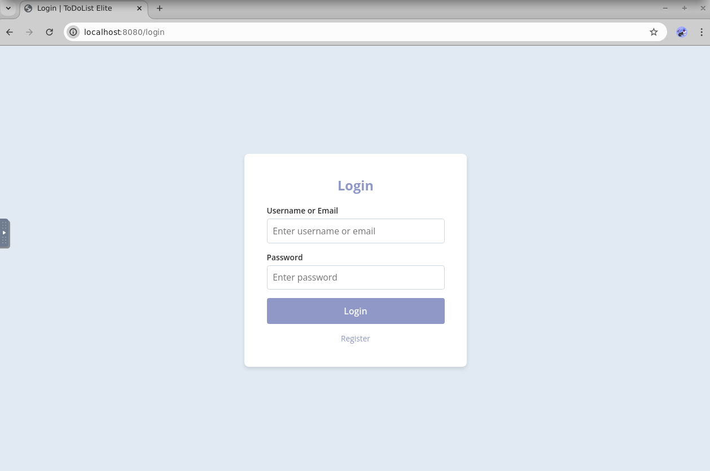
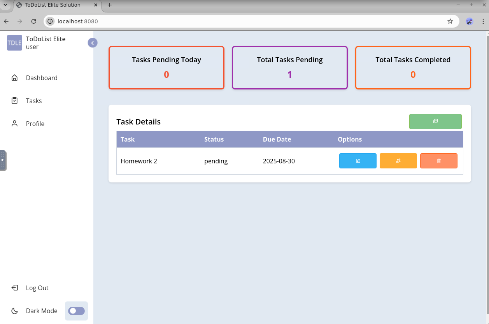
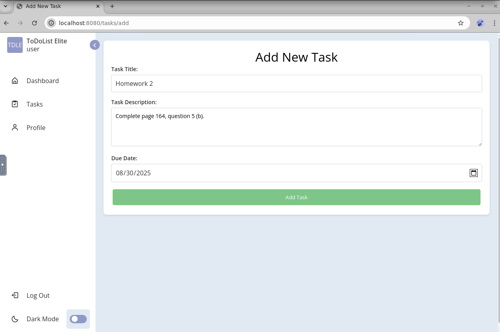

# ToDo-Rails ✅
A full-stack **Task Management Application** built with **Java, Spring Boot, MySQL, Thymeleaf, and JavaScript**.  
This project was developed as part of the **Amazon Junior Software Developer Course** capstone project and demonstrates industry best practices in building a secure, user-friendly, and fully functional application.

---

## 🚀 Features
- 🔐 **User Authentication & Security**
  - Registration and login functionality
  - Role-based access control
  - Secure password hashing
- 📝 **Task Management**
  - Create, Read, Update, and Delete (CRUD) tasks
  - Assign due dates and track completion
- ✅ **Data Validation**
  - Server-side and client-side validation
  - Error handling and input sanitization
- 🗄️ **Database Integration**
  - Persistent storage using **MySQL**
- 🎨 **Frontend**
  - Built with **Thymeleaf** templates and **JavaScript** for dynamic UI
- 🧪 **Testing & Code Quality**
  - Unit and integration tests
  - Follows Spring Boot best practices

---

## 🖼️ Screenshots

### Login Page


### Task List


### Create Task Form


---

## 🛠️ Tech Stack
- **Backend:** Java, Spring Boot, Spring Security, Hibernate/JPA  
- **Frontend:** Thymeleaf, JavaScript, HTML, CSS  
- **Database:** MySQL  
- **Build Tool:** Maven  
- **Testing:** JUnit, Mockito  

---

## Deployment

This project was deployed on **AWS EC2** for testing purposes.
Currently, the EC2 instance is **turned off**, so the live demo link is unavailable.

To run the project locally, follow the steps below.

---

## ✅ Prerequisites
- Java 17+ (or the version your project targets)
- Maven 3.8+
- MySQL 8+

---

## ⚙️ Installation & Setup

### 1. Clone the repository
```bash
git clone https://github.com/tahmidWasif/ToDo-Rails.git
cd ToDo-Rails
```

### 2. Configure the database
- Install and run MySQL
- Create a database (e.g. todo_db).
- Update application.properties with your MySQL username & password:
```properties
spring.datasource.url=jdbc:mysql://localhost:3306/todo_db
spring.datasource.username=your_username
spring.datasource.password=your_password
spring.jpa.hibernate.ddl-auto=update
```

### 3. Build & Run the project
```bash
mvn spring-boot:run
```

### 4. Run the App
```bash
mvn spring-boot:run
```
Then open: `http://localhost:8080`

---

## 📂 Project Structure
```
ToDo-Rails/
 ├─ src/
 │  ├─ main/
 │  │  ├─ java/...                 # Controllers, services, repositories, models, security
 │  │  ├─ resources/
 │  │  │  ├─ templates/            # Thymeleaf views
 │  │  │  ├─ static/               # CSS/JS/assets
 │  │  │  └─ application.properties
 │  └─ test/java/...               # Unit & integration tests
 ├─ pom.xml                        # Maven configuration
 └─ README.md
```

---

## 🧪 Testing
```bash
mvn test
```

---

## 🔄 Roadmap / Future Work
- Task categories & priorities
- Search & filters
- Email/SMS reminders
- REST API for mobile clients
- Docker-compose for one-command setup
